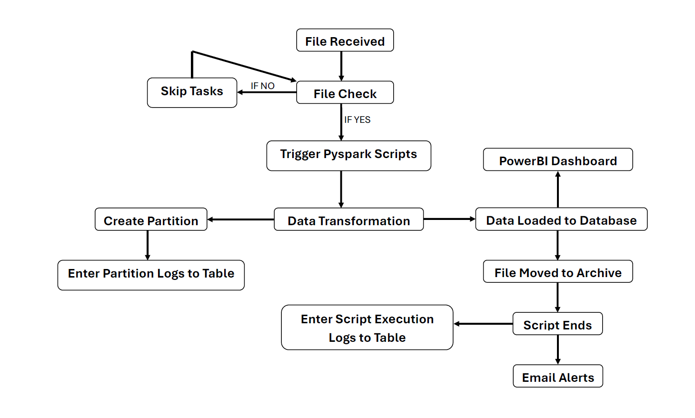

# IPL Data Engineering Pipeline

Automated and Partition-Aware ETL pipeline for IPL data
End-to-end Data Engineering project using Hadoop, PySpark, PostgreSQL, and Airflow

---

## Overview

This project builds a complete data engineering pipeline for IPL cricket data. It covers ingestion, cleaning, merging, transformation, and loading into PostgreSQL, with orchestration handled by Airflow. The pipeline is designed to behave like a real production workflow.

---

## Objectives

1. Set up an integrated environment connecting Hadoop, PySpark, PostgreSQL, and Airflow.
2. Design database tables to store IPL-related datasets.
3. Develop PySpark and Python scripts to clean, transform, and load data into PostgreSQL.
4. Implement HDFS partitioning and logging to keep historical data and maintain transparency.
5. Orchestrate the entire workflow using Airflow for automation and monitoring.
6. Add a check-file based trigger so tasks run only when files arrive in their folders.

---

## Architecture Diagram



---

## Features

* Automated workflow managed by Airflow
* File-based triggering using a check file system
* Data storage in HDFS with partitioning
* PySpark workloads for cleaning and transformation
* PostgreSQL warehouse for structured IPL data
* Clear logging and audit tracking across all pipeline stages
* Designed to mimic real-world production pipelines

---

## Tech Stack

| Layer               | Tools                               |
| ------------------- | ----------------------------------- |
| Processing          | PySpark, Python                     |
| Storage             | PostgreSQL                          |
| Big Data            | Hadoop, HDFS                        |
| Orchestration       | Apache Airflow                      |
| OS                  | Linux                               |
| Logging & Utilities | Python logging, Airflow metadata DB |

---

## Project Structure

```
project/
│
├── dags/
│   └── ipl_pipeline_dag.py
│
├── pyspark_jobs/
│   ├── clean_data.py
│   ├── transform_data.py
│   └── load_to_postgres.py
│
├── sql/
│   └── create_tables.sql
│
├── hdfs/
│   ├── landing/
│   ├── processed/
│   └── checkpoints/
│
├── logs/
│
├── assets/
│   ├── banner.png
│   └── architecture.png
│
└── README.md
```

---

## How the Pipeline Works

1. New IPL data files arrive in the HDFS landing folder.
2. A check file is placed in the same folder.
3. Airflow detects the check file and starts the DAG.
4. PySpark reads raw files, cleans them, and writes partitioned outputs.
5. The processed data is loaded into PostgreSQL tables.
6. Logs are generated for traceability and auditing.
7. Historical partitions remain intact for future analysis.

---

## Setup Instructions

### 1. Install and Configure Hadoop

* Set up HDFS directories
* Update `core-site.xml` and `hdfs-site.xml`
* Start NameNode and DataNode

### 2. Install PySpark and Dependencies

```
pip install pyspark psycopg2 pandas
```

### 3. Set Up PostgreSQL

* Create a database
* Run scripts in `sql/create_tables.sql`

### 4. Install and Configure Airflow

```
pip install apache-airflow
airflow db init
airflow users create ...
```

Place your DAG inside:

```
$AIRFLOW_HOME/dags/
```

### 5. Start Services

```
start-dfs.sh
airflow scheduler
airflow webserver
```

### 6. Run the Pipeline

* Place input files in: `/user/hadoop/landing/`
* Add a check file: `file_ready.chk`
* Trigger the DAG manually or let the scheduler pick it up

---

## Sample SQL Queries

```sql
SELECT match_id, team1, team2, venue
FROM ipl_matches
ORDER BY match_id DESC;
```

```sql
SELECT season, COUNT(*) AS total_matches
FROM ipl_matches
GROUP BY season;
```

---

## Future Enhancements

* Add validation rules before ingestion
* Include schema registry
* Add streaming support with Kafka
* Expose APIs for analytics
* Add dashboards for monitoring

---

## Contributing

Pull requests are welcome.
For major changes, open an issue to discuss what you want to update.

Steps:

1. Fork the repository
2. Create a feature branch
3. Commit your changes
4. Open a pull request

---

## License

This project is released under the MIT License.

---

## Author

**AAYU**
Data Engineer
GitHub: ayushhsharma88
LinkedIn: www.linkedin.com/in/ayushh-sharma88

---
